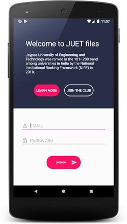

# JUET-Files
The project aims for developing a Customized, User-Friendly Android Application for the hostel related concerns such as Room Maintenance (Fan, Light, Bulb, Switch Board, Bed, Chair, Window panes), Requisition and Approval of Out Passes, Laundry section, Notice Board, First-Aid Service, Lend &amp; Borrow Section (Old books, Extra tickets, Printers, Cooler etc.), General Information Report (Water cooler, Toilet-Bathroom cleaning), Help Desk etc.

